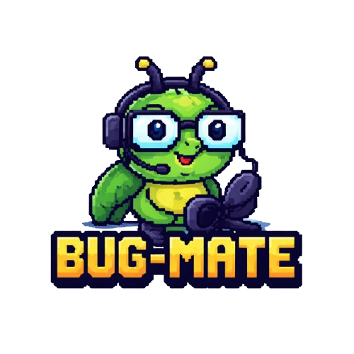

<p align="center">
  
</p>

# BugMate

Bot de atención al cliente para WhatsApp, diseñado para software factories. Permite configurar flujos guiados, respuestas automáticas por IA, base de conocimiento semántica y escalación a soporte humano — todo desde archivos JSON, sin tocar código.

---

## Índice

- [Requisitos](#requisitos)
- [Instalación](#instalación)
- [Configuración inicial (.env)](#configuración-inicial-env)
- [Proveedor de IA](#proveedor-de-ia)
  - [Gemini (Google)](#gemini-google)
  - [Ollama (local / open source)](#ollama-local--open-source)
- [Configuración del bot (bot.config.json)](#configuración-del-bot-botconfigjson)
  - [identity](#identity)
  - [greeting](#greeting)
  - [menu](#menu)
  - [flows — Flujos guiados](#flows--flujos-guiados)
  - [flows — Flujos de IA](#flows--flujos-de-ia)
  - [ai](#ai)
  - [humanDelay](#humandelay)
  - [media — Procesar imágenes y audio](#media--procesar-imágenes-y-audio)
  - [escalation](#escalation)
- [Clientes (clients.json)](#clientes-clientsjson)
- [Base de conocimiento](#base-de-conocimiento)
  - [FAQs estructuradas (knowledge.json)](#faqs-estructuradas-knowledgejson)
  - [Documentos de conocimiento (knowledge-docs/)](#documentos-de-conocimiento-knowledge-docs)
- [Grupo de control (toma de conversación humana)](#grupo-de-control-toma-de-conversación-humana)
- [Estructura de archivos](#estructura-de-archivos)
- [Ejemplos completos de flujos](#ejemplos-completos-de-flujos)

---

## Requisitos

- Node.js 18+
- npm
- Una cuenta de WhatsApp vinculada al bot (número dedicado recomendado)
- Un proveedor de IA: **Gemini** (API key gratuita) o **Ollama** (local, open source)

---

## Instalación

```bash
git clone https://github.com/tu-usuario/bug-mate.git
cd bug-mate
npm install
cp .env.example .env
```

Editá `.env` con tu configuración, luego:

```bash
npm run start
```

Al iniciar por primera vez, el bot mostrará un código QR en la consola. Escanealo desde WhatsApp en tu teléfono (**Dispositivos vinculados → Vincular dispositivo**). La sesión queda guardada en `.wwebjs_auth/` y no necesitás escanear de nuevo.

---

## Configuración inicial (.env)

```env
# Proveedor de IA: "gemini" o "ollama"
AI_PROVIDER=gemini

# API key de Gemini (solo si AI_PROVIDER=gemini)
GEMINI_API_KEY=tu_api_key

# URL de Ollama (solo si AI_PROVIDER=ollama)
OLLAMA_URL=http://localhost:11434
OLLAMA_AUTO_START=false

# Tu nombre — aparece en mensajes de escalación al cliente
DEVELOPER_NAME=Ignacio

# Tu número de WhatsApp en formato internacional, solo dígitos
# Ejemplo Argentina: 5491123456789
DEVELOPER_PHONE=5491123456789

# ID del grupo de control (opcional, ver sección más abajo)
# CONTROL_GROUP_ID=120363XXXXXXXXXX@g.us

PORT=3000
```

---

## Proveedor de IA

### Gemini (Google)

La opción más simple para empezar. Tiene un tier gratuito.

1. Obtené tu API key en [aistudio.google.com](https://aistudio.google.com/app/apikey)
2. En `.env`:
   ```env
   AI_PROVIDER=gemini
   GEMINI_API_KEY=tu_api_key
   ```
3. En `config/bot.config.json`, sección `ai`:
   ```json
   "model": "gemini-2.0-flash",
   "embeddingModel": "gemini-embedding-001"
   ```

**Modelos disponibles:** `gemini-2.0-flash` (recomendado, rápido), `gemini-1.5-pro` (más capaz, más lento).

---

### Ollama (local / open source)

Corrés la IA completamente en tu máquina, sin cuotas ni API keys.

#### 1. Instalar Ollama

Descargá desde [ollama.com](https://ollama.com) e instalá.

#### 2. Descargar los modelos

Necesitás un modelo de **chat** y un modelo de **embeddings** (para la base de conocimiento):

```bash
# Modelo de chat (elegí uno):
ollama pull qwen3:8b       # Recomendado — buena calidad, 5 GB
ollama pull llama3.2:3b    # Más liviano, 2 GB
ollama pull mistral:7b     # Alternativa sólida, 4 GB

# Modelo de embeddings (requerido para búsqueda semántica en documentos):
ollama pull nomic-embed-text
```

#### 3. Configurar

En `.env`:
```env
AI_PROVIDER=ollama
OLLAMA_URL=http://localhost:11434
OLLAMA_AUTO_START=false  # "true" si querés que el bot inicie Ollama automáticamente
```

En `config/bot.config.json`, sección `ai`:
```json
"model": "qwen3:8b",
"embeddingModel": "nomic-embed-text"
```

#### Comparación de modelos de chat para Ollama

| Modelo | Tamaño | Calidad | Velocidad |
|--------|--------|---------|-----------|
| `qwen3:8b` | 5 GB | ⭐⭐⭐⭐⭐ | Media |
| `llama3.2:3b` | 2 GB | ⭐⭐⭐ | Rápida |
| `mistral:7b` | 4 GB | ⭐⭐⭐⭐ | Media |
| `llama3.1:8b` | 5 GB | ⭐⭐⭐⭐ | Media |

> **Nota:** Si no usás búsqueda semántica en documentos (solo FAQs por keywords o flows de IA con `"useKnowledge": false`), no necesitás `nomic-embed-text`.

---

## Configuración del bot (bot.config.json)

Toda la lógica conversacional vive en `config/bot.config.json`. No necesitás reiniciar el servidor para ver cambios en los textos — solo reiniciá el proceso.

---

### identity

Define quién es el bot.

```json
"identity": {
  "name": "BugMate",
  "company": "CuyoCode",
  "developerName": "Ignacio",
  "tone": "amigable, empático y conciso. Usá lenguaje natural como si fueras una persona real."
}
```

Estos valores están disponibles como `{botName}`, `{company}`, `{developerName}` y `{tone}` en todos los templates de mensajes y en el system prompt de la IA.

---

### greeting

Configura el saludo que recibe el usuario al iniciar o retomar una conversación.

```json
"greeting": {
  "enabled": true,
  "message": "¡Hola {clientName}! 👋 Soy *{botName}*, el asistente de *{company}*.\n\n¿En qué te puedo ayudar hoy?",
  "unknownClientName": "👋",
  "sessionTimeoutMinutes": 30
}
```

| Campo | Descripción |
|-------|-------------|
| `enabled` | `false` para ir directo al menú sin saludar |
| `message` | Texto del saludo. Soporta `{clientName}`, `{botName}`, `{company}` |
| `unknownClientName` | Fallback cuando el número no está en `clients.json` |
| `sessionTimeoutMinutes` | Minutos de inactividad antes de reiniciar la sesión y mostrar el saludo de nuevo |

---

### menu

Define las opciones que ve el usuario. Podés agregar todas las que necesites.

```json
"menu": {
  "message": "Elegí una opción respondiendo con el número:",
  "invalidChoiceMessage": "No entendí tu respuesta.",
  "unrecognizedOptionMessage": "Opción no reconocida.",
  "options": [
    { "id": "1", "label": "🐛 Reportar un error",     "flowId": "reportError" },
    { "id": "2", "label": "❓ Consultar una duda",     "flowId": "queryKnowledge" },
    { "id": "3", "label": "👨‍💻 Hablar con soporte",   "action": "ESCALATE" },
    { "id": "4", "label": "📋 Ver menú de nuevo",      "action": "SHOW_MENU" }
  ]
}
```

**Tipos de opción:**

| Propiedad | Descripción |
|-----------|-------------|
| `flowId` | Apunta a un flow definido en `flows`. Puede ser `guided` o `ai` |
| `action: "ESCALATE"` | Escala directamente al desarrollador |
| `action: "SHOW_MENU"` | Vuelve a mostrar el menú |

---

### flows — Flujos guiados

Un flujo guiado hace preguntas al usuario paso a paso y al final notifica al desarrollador con las respuestas recolectadas.

```json
"flows": {
  "reportError": {
    "type": "guided",
    "steps": [
      {
        "key": "description",
        "prompt": "Contame qué está pasando. ¿Qué estabas haciendo cuando ocurrió?"
      },
      {
        "key": "screenshot",
        "prompt": "¿Podés enviarme una captura de pantalla? Si no tenés, escribí *no tengo*."
      }
    ],
    "noMediaFallback": "No adjuntó captura",
    "confirmationMessage": "Registré el reporte. Voy a notificar a *{developerName}* a la brevedad. 🙏",
    "developerNotification": "🐛 *Nuevo error*\n\n*Cliente:* {clientName} ({clientPhone})\n*Descripción:* {description}\n*Captura:* {screenshot}"
  }
}
```

| Campo | Descripción |
|-------|-------------|
| `type` | Siempre `"guided"` |
| `steps` | Array de pasos. Cada paso tiene `key` (nombre interno) y `prompt` (mensaje al usuario) |
| `noMediaFallback` | Texto usado cuando un paso espera media pero el usuario no envía nada |
| `confirmationMessage` | Mensaje al cliente cuando todos los pasos se completan. Soporta `{developerName}` y cualquier `key` de los steps |
| `developerNotification` | Mensaje al desarrollador. Soporta `{clientName}`, `{clientPhone}`, `{developerName}` y cualquier `key` de los steps como `{description}`, `{screenshot}` |

Podés agregar tantos pasos como necesites:

```json
"onboarding": {
  "type": "guided",
  "steps": [
    { "key": "empresa", "prompt": "¿En qué empresa trabajás?" },
    { "key": "rol",     "prompt": "¿Cuál es tu rol?" },
    { "key": "sistema", "prompt": "¿Qué sistema estás usando?" }
  ],
  "confirmationMessage": "¡Gracias! Registré tus datos.",
  "developerNotification": "🆕 Nuevo usuario: {empresa} — {rol} — {sistema}"
}
```

---

### flows — Flujos de IA

Un flujo de IA le pasa el control a la inteligencia artificial. Puede responder usando la base de conocimiento (RAG) o libremente.

```json
"flows": {
  "queryKnowledge": {
    "type": "ai",
    "inputPrompt": "Contame tu consulta y voy a buscar la información:",
    "textOnlyMessage": "Por favor escribí tu consulta con texto.",
    "useKnowledge": true,
    "ragContextInstruction": "Respondé de forma natural y conversacional.",
    "fallbackToEscalation": true,
    "noResultMessage": "No encontré información sobre eso. Voy a notificar a *{developerName}*.",
    "noResultDeveloperNotification": "❓ Consulta sin respuesta\n*Cliente:* {clientName}\n*Consulta:* {query}",
    "continuePrompt": "¿Algo más? Respondé *menú* para ver las opciones."
  }
}
```

| Campo | Descripción |
|-------|-------------|
| `type` | Siempre `"ai"` |
| `inputPrompt` | Mensaje que le pide al usuario que escriba su consulta |
| `textOnlyMessage` | Se envía si el usuario manda imagen o audio cuando se espera texto |
| `useKnowledge` | `true` para buscar en la base de conocimiento antes de responder. `false` para respuesta libre |
| `systemPromptOverride` | (Opcional) Reemplaza el system prompt global solo para este flow. Soporta `{company}`, `{botName}`, `{developerName}`, `{tone}` |
| `ragContextInstruction` | Instrucción adicional al prompt cuando se encontró conocimiento |
| `fallbackToEscalation` | `true`: si no hay conocimiento, escala al dev. `false`: la IA responde igual sin contexto |
| `noResultMessage` | Mensaje al cliente cuando no hay conocimiento y se escala. Soporta `{developerName}` |
| `noResultDeveloperNotification` | Notificación al dev. Soporta `{clientName}`, `{clientPhone}`, `{query}` |
| `continuePrompt` | Mensaje enviado al cliente después de una respuesta exitosa |

**Ejemplo — IA libre sin base de conocimiento:**

```json
"ventas": {
  "type": "ai",
  "inputPrompt": "¿Qué querés saber sobre nuestros servicios?",
  "textOnlyMessage": "Por favor escribí tu consulta.",
  "useKnowledge": false,
  "systemPromptOverride": "Sos el asistente de ventas de {company}. Respondé sobre servicios y precios. Sé entusiasta y profesional.",
  "continuePrompt": "¿Tenés alguna otra consulta?"
}
```

---

### ai

Parámetros globales del proveedor de IA.

```json
"ai": {
  "model": "gemini-2.0-flash",
  "embeddingModel": "gemini-embedding-001",
  "systemPrompt": "Sos {botName}, el asistente de soporte de {company}. Ayudá a los clientes con sus dudas. Usá español rioplatense.",
  "ragMinScore": 0.72,
  "ragTopK": 3,
  "fallbackToEscalation": true,
  "maxHistoryMessages": 10
}
```

| Campo | Descripción |
|-------|-------------|
| `model` | Modelo de chat. Gemini: `gemini-2.0-flash`, `gemini-1.5-pro`. Ollama: `qwen3:8b`, `llama3.2:3b`, etc. |
| `embeddingModel` | Modelo para embeddings. Gemini: `gemini-embedding-001`. Ollama: `nomic-embed-text` |
| `systemPrompt` | Prompt base del asistente. Soporta `{company}`, `{botName}`, `{developerName}`, `{tone}` |
| `ragMinScore` | Score mínimo (0–1) para aceptar un resultado de búsqueda semántica. `0.72` es un buen valor |
| `ragTopK` | Cuántos resultados de búsqueda vectorial considerar |
| `fallbackToEscalation` | Default global cuando no se encuentra conocimiento. Se puede sobreescribir por flow |
| `maxHistoryMessages` | Cuántos mensajes anteriores se guardan en sesión para contexto |

---

### humanDelay

Simula que el bot es una persona real, con delay de lectura y tipeo visible en WhatsApp.

```json
"humanDelay": {
  "enabled": true,
  "readingDelayMinMs": 1000,
  "readingDelayMaxMs": 3500,
  "minDelayMs": 2000,
  "maxDelayMs": 12000,
  "msPerCharacter": 55
}
```

| Campo | Descripción |
|-------|-------------|
| `enabled` | `false` para deshabilitar todo delay (recomendado en desarrollo) |
| `readingDelayMinMs` / `readingDelayMaxMs` | Rango aleatorio antes de empezar a "tipear" |
| `msPerCharacter` | Milisegundos por caracter para calcular el tiempo de tipeo |
| `minDelayMs` / `maxDelayMs` | Límites del tiempo de tipeo, sin importar el largo del mensaje |

---

### media — Procesar imágenes y audio

```json
"media": {
  "processImages": true,
  "processAudio": true,
  "imagePrompt": "Analizá esta imagen. Si es una captura de pantalla, describí qué ves: errores, botones, formularios.",
  "audioPrompt": "Transcribí exactamente el mensaje de audio en español.",
  "unsupportedMessage": "Recibí tu {mediaType}, pero por ahora no puedo procesarlo. ¿Podés describirlo con texto?"
}
```

| Campo | Descripción |
|-------|-------------|
| `processImages` | `true` para que la IA analice imágenes (requiere modelo con visión) |
| `processAudio` | `true` para que la IA transcriba audios y notas de voz |
| `imagePrompt` | Instrucción que se le da a la IA cuando recibe una imagen |
| `audioPrompt` | Instrucción que se le da a la IA cuando recibe un audio |
| `unsupportedMessage` | Respuesta para tipos no soportados (video, documento, sticker). `{mediaType}` se reemplaza con el tipo |

> **Con Ollama:** El procesamiento de imágenes requiere un modelo multimodal como `llava`. `qwen3:8b` no soporta imágenes. Recomendamos `processImages: false` con Ollama salvo que uses `llava`.

---

### escalation

Configura la escalación automática al desarrollador.

```json
"escalation": {
  "keywords": [
    "hablar con alguien",
    "soporte humano",
    "quiero hablar con una persona",
    "hablar con ignacio"
  ],
  "clientMessage": "Entendido. Voy a notificar a *{developerName}* para que se comunique con vos. 🙏",
  "developerNotification": "🔔 *Solicitud de soporte*\n\n*Cliente:* {clientName} ({clientPhone})\n*Mensaje:* \"{message}\"",
  "alreadyEscalatedMessage": "Tu consulta ya fue enviada a *{developerName}*. En cuanto pueda se va a comunicar con vos. 🙏"
}
```

| Campo | Descripción |
|-------|-------------|
| `keywords` | Si el usuario escribe cualquiera de estas frases en cualquier momento, se escala automáticamente |
| `clientMessage` | Lo que le dice el bot al cliente al escalar. Soporta `{developerName}` |
| `developerNotification` | Mensaje enviado al desarrollador. Soporta `{clientName}`, `{clientPhone}`, `{message}` |
| `alreadyEscalatedMessage` | Respuesta si el cliente escribe después de ya haber escalado |

---

## Clientes (clients.json)

Define tus clientes para que el bot los reconozca por número y los salude por nombre.

```json
[
  {
    "phone": "5491123456789",
    "name": "María García",
    "company": "Empresa Ejemplo S.A.",
    "systems": ["Sistema de Facturación", "Portal de Reportes"],
    "notes": "Usuaria principal del módulo de facturación"
  },
  {
    "phone": "5491187654321",
    "name": "Carlos López",
    "company": "Distribuidora Norte",
    "systems": ["Sistema de Stock"]
  }
]
```

| Campo | Descripción |
|-------|-------------|
| `phone` | Número en formato internacional, solo dígitos. Argentina: `549` + número sin 0 ni 15 |
| `name` | Nombre del cliente, usado en el saludo y en notificaciones al desarrollador |
| `company` | Empresa del cliente |
| `systems` | Lista de sistemas que usa (informativo) |
| `notes` | Notas internas, no se envían al cliente |

Si un número no está registrado, el bot usa el valor de `greeting.unknownClientName` como nombre.

> **Formato Argentina:** el número `011 1234-5678` se escribe como `5491112345678` (549 + 11 + número sin el 15).

---

## Base de conocimiento

El sistema de conocimiento tiene dos capas que se consultan en orden:

### FAQs estructuradas (knowledge.json)

Ideal para preguntas frecuentes con respuesta fija. La búsqueda es por keywords, sin costo de IA ni embeddings.

```json
[
  {
    "id": "backup",
    "tags": ["backup", "copia de seguridad", "respaldo", "recuperar datos"],
    "question": "¿Cómo hago un backup?",
    "answer": "El sistema realiza backups automáticos diariamente a las 2 AM.",
    "steps": [
      "Ir a Configuración → Backups",
      "Hacer clic en 'Backup manual'",
      "Esperar confirmación"
    ]
  }
]
```

| Campo | Descripción |
|-------|-------------|
| `id` | Identificador único |
| `tags` | Palabras o frases clave. Si el usuario escribe alguna, se activa esta entrada |
| `question` | Pregunta de referencia (también usada para matching) |
| `answer` | Respuesta que se le pasa a la IA como contexto |
| `steps` | (Opcional) Pasos que se agregan a la respuesta |

---

### Documentos de conocimiento (knowledge-docs/)

Para documentación más extensa. Colocá archivos `.md` o `.txt` en `config/knowledge-docs/`. Se indexan automáticamente en una base vectorial (SQLite) al arrancar.

```
config/
  knowledge-docs/
    sistema-facturacion.md
    guia-de-uso.md
    preguntas-frecuentes.md
```

El contenido se divide en chunks y se busca semánticamente. Los parámetros `ragMinScore` y `ragTopK` controlan la sensibilidad.

> **Cambio de proveedor:** Si cambiás de Gemini a Ollama o viceversa, los embeddings no son compatibles. Borrá `data/knowledge.sqlite` y reiniciá para reindexar.

---

## Grupo de control (toma de conversación humana)

Permite pausar el bot y tomar el control de conversaciones directamente desde WhatsApp, sin que el cliente note nada.

### Setup

1. Creá un grupo en WhatsApp (puede ser solo vos)
2. Agregá el número del bot al grupo
3. Enviá `!grupos` desde el grupo — el bot responde con todos sus grupos e IDs
4. Copiá el ID y pegalo en `.env`:
   ```env
   CONTROL_GROUP_ID=120363XXXXXXXXXX@g.us
   ```
5. Reiniciá el servidor

### Pausa automática

Cuando enviás un mensaje **manualmente** desde tu teléfono a un cliente, el bot se pausa automáticamente para ese número y te avisa en el grupo de control:

> ⏸️ Bot pausado para **5491112345678** — tomaste el control de la conversación.
> Usá `!reactivar 5491112345678` cuando termines.

### Comandos

Enviados desde el grupo de control:

| Comando | Descripción |
|---------|-------------|
| `!grupos` | Lista todos los grupos donde está el bot con sus IDs |
| `!estado` | Muestra qué números tienen el bot pausado actualmente |
| `!pausar <número>` | Pausa el bot para ese número antes de escribirle |
| `!reactivar <número>` | Reactiva el bot para ese número |

Ejemplo: `!reactivar 5491112345678` (sin `@c.us`, sin `+`, sin espacios).

---

## Estructura de archivos

```
bug-mate/
├── config/
│   ├── bot.config.json        # Toda la lógica conversacional
│   ├── clients.json           # Clientes registrados
│   ├── knowledge.json         # FAQs estructuradas (búsqueda por keywords)
│   └── knowledge-docs/        # Documentos para búsqueda semántica (.md, .txt)
├── data/
│   └── knowledge.sqlite       # Base vectorial (generada automáticamente)
├── src/
│   └── modules/
│       ├── ai/                # Proveedores de IA (Gemini, Ollama)
│       ├── bot/               # Lógica principal y máquina de estados
│       ├── config/            # Carga de .env y archivos JSON
│       ├── knowledge/         # Búsqueda FAQ + vectorial
│       ├── messaging/         # Adaptador WhatsApp
│       └── session/           # Sesiones de conversación (en memoria)
├── .env                       # Secrets (no commitear)
├── .env.example               # Template de configuración
└── .wwebjs_auth/              # Sesión de WhatsApp (generada automáticamente)
```

---

## Ejemplos completos de flujos

### Soporte técnico con IA y base de conocimiento

```json
"soporte": {
  "type": "ai",
  "inputPrompt": "Describí tu consulta técnica:",
  "textOnlyMessage": "Por favor escribí tu consulta con texto.",
  "useKnowledge": true,
  "ragContextInstruction": "Respondé con precisión técnica, paso a paso si es necesario.",
  "fallbackToEscalation": true,
  "noResultMessage": "No tengo información específica sobre eso. Te conecto con *{developerName}*.",
  "noResultDeveloperNotification": "🔧 Consulta técnica sin respuesta\n*Cliente:* {clientName}\n*Consulta:* {query}",
  "continuePrompt": "¿Resolvió tu duda? Si necesitás algo más, escribí *menú*."
}
```

### Asistente de ventas libre

```json
"ventas": {
  "type": "ai",
  "inputPrompt": "¡Hola! ¿Qué querés saber sobre nuestros servicios?",
  "textOnlyMessage": "Por favor escribí tu consulta.",
  "useKnowledge": false,
  "systemPromptOverride": "Sos el asistente de ventas de {company}. Respondé sobre servicios, precios y propuestas. Sé entusiasta y profesional. Si no tenés el dato exacto, ofrecé coordinar una reunión.",
  "continuePrompt": "¿Tenés alguna otra consulta sobre nuestros servicios?"
}
```

### Formulario de nueva funcionalidad

```json
"nuevaFuncionalidad": {
  "type": "guided",
  "steps": [
    { "key": "funcionalidad", "prompt": "¿Qué funcionalidad necesitás? Describila con el mayor detalle posible." },
    { "key": "motivo",        "prompt": "¿Para qué la necesitás? ¿Qué problema resolvería?" },
    { "key": "urgencia",      "prompt": "¿Con qué urgencia la necesitás? (baja / media / alta)" }
  ],
  "confirmationMessage": "Registré tu solicitud. *{developerName}* la va a revisar y te contactará pronto. 🙌",
  "developerNotification": "💡 *Nueva funcionalidad solicitada*\n\n*Cliente:* {clientName} ({clientPhone})\n*Funcionalidad:* {funcionalidad}\n*Motivo:* {motivo}\n*Urgencia:* {urgencia}"
}
```

### Encuesta de satisfacción

```json
"encuesta": {
  "type": "guided",
  "steps": [
    { "key": "puntuacion", "prompt": "Del 1 al 10, ¿cómo calificarías el soporte que recibiste?" },
    { "key": "comentario",  "prompt": "¿Tenés algún comentario o sugerencia? (Podés escribir *no* si no tenés)" }
  ],
  "confirmationMessage": "¡Gracias por tu feedback! Tu opinión nos ayuda a mejorar. 🙏",
  "developerNotification": "⭐ *Encuesta de satisfacción*\n\n*Cliente:* {clientName}\n*Puntuación:* {puntuacion}/10\n*Comentario:* {comentario}"
}
```

### Reporte de error con sistema afectado

```json
"reporteAvanzado": {
  "type": "guided",
  "steps": [
    { "key": "sistema",      "prompt": "¿Qué módulo o sección del sistema tuvo el problema?" },
    { "key": "descripcion",  "prompt": "Describí el error detalladamente. ¿Qué estabas haciendo?" },
    { "key": "reproducible", "prompt": "¿El error ocurre siempre o fue una sola vez?" },
    { "key": "captura",      "prompt": "¿Podés enviarme una captura de pantalla? Si no tenés, escribí *no tengo*." }
  ],
  "noMediaFallback": "Sin captura",
  "confirmationMessage": "Registré el reporte completo. *{developerName}* lo va a revisar a la brevedad. 🙏",
  "developerNotification": "🐛 *Reporte detallado*\n\n*Cliente:* {clientName} ({clientPhone})\n*Módulo:* {sistema}\n*Descripción:* {descripcion}\n*¿Reproducible?:* {reproducible}\n*Captura:* {captura}"
}
```
